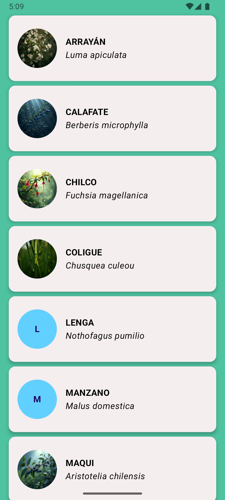

# 🌿 LazyColumnApp - Flora Nativa de Chile
## Objetivo:
Construir una aplicación Android que despliegue una lista de especies nativas chilenas usando **Jetpack Compose** y la componente **LazyColumn** para un renderizado eficiente.


## 🚀 Características


- ✅ Se implementó un **modelo de datos `ChileanTree`** con atributos: `id`, `name`, `latinName` y `image`.
- ✅ Se definió un **repositorio de datos `ChileanTreeData`**, con una lista de especies (ejemplo: Arrayán, Calafate, Maqui, etc.), incluyendo imágenes de recurso o inicial en caso de no contar con ellas.
- ✅ Se creó el **composable `TreeItem`**, que muestra cada especie dentro de una **Card** con diseño de **Material 3**:
- ✅ Imágenes circulares representando cada especie.
    - Nombre científico en **cursiva**.
    - Nombre común en **negrita**.
- ✅ Se desarrolló la pantalla principal **`TreeListScreen`**, donde se renderiza la lista completa mediante **LazyColumn**, optimizando el rendimiento y permitiendo desplazamiento fluido.
- ✅ Las especies fueron ordenadas **alfabéticamente** para mejorar la visualización.


## 📂 Estructura del Proyecto

- **`data/ChileanTree.kt`** → Modelo de datos de cada árbol/planta.
- **`data/ChileanTreeData.kt`** → Fuente de datos con especies nativas chilenas.
- **`components/TreeItem.kt`** → Composable que representa cada ítem de la lista con imagen, nombre y nombre científico.
- **`ui/theme/screens/TreeListScreen.kt`** → Pantalla principal con la LazyColumn que consume los datos.

## 🌱 Ejemplo de Datos

```kotlin
ChileanTree("1", "Arrayán", "Luma apiculata", R.drawable.arrayan),
ChileanTree("2", "Calafate", "Berberis microphylla", R.drawable.calafate),
ChileanTree("3", "Chilco", "Fuchsia magellanica", R.drawable.chilco)
```

## 📱 Capturas de Pantalla
<p float="left">
  
</p>

